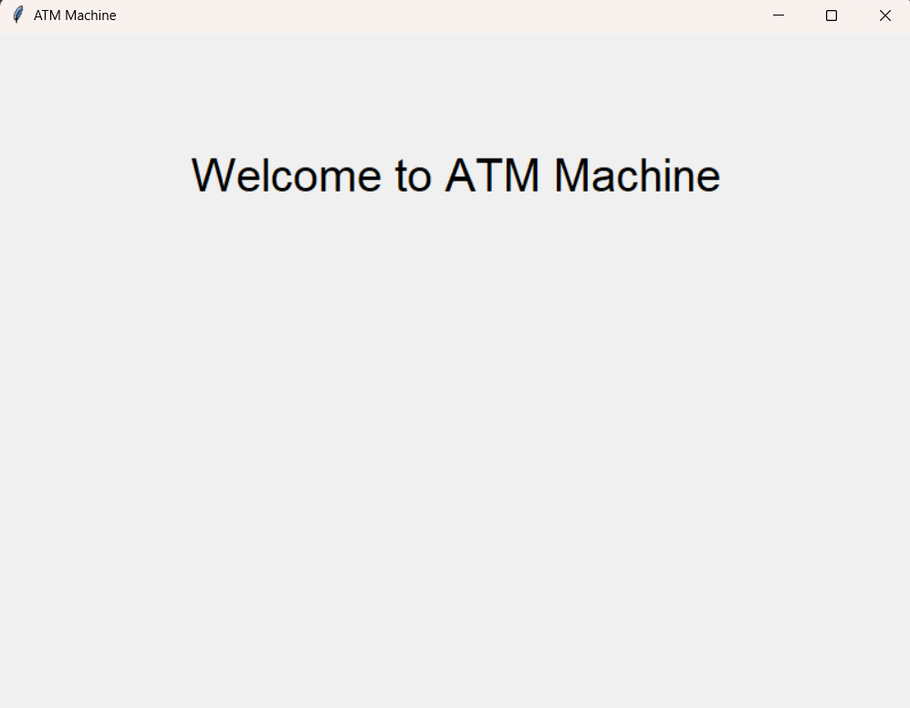
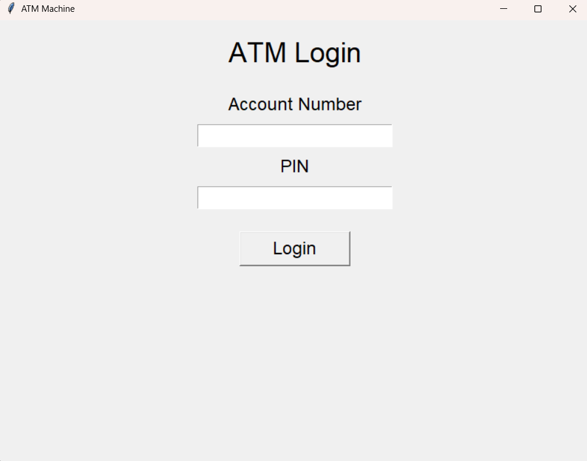
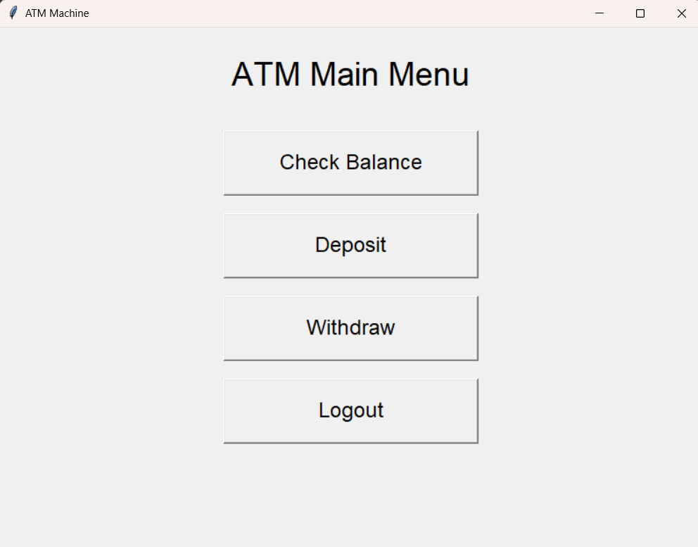

# 🏧 ATM Machine - Python

A Python-based ATM Machine desktop application with a graphical user interface and voice assistance.

## 📌 Features

- 🔐 Account number and PIN authentication
- 💰 Check account balance
- 💵 Deposit money
- 💸 Withdraw money
- 🔊 Voice assistance
- 🚪 Logout functionality
- 🖥️ GUI using Tkinter

## 🛠️ Technologies Used

- Python
- Tkinter
- pyttsx3
- Threading

## 📂 Project Structure

```text
ATM-Machine-Python/
│
├── ATM.py
├── README.md
├── requirements.txt
├── .gitignore
└── Screenshots/
    ├── Welcome.png
    ├── Login.png
    └── Main-menu.png
```

## 📸 Application Screenshots

### 🏧 Welcome Screen



### 🔐 Login Screen



### 💳 Main Menu

